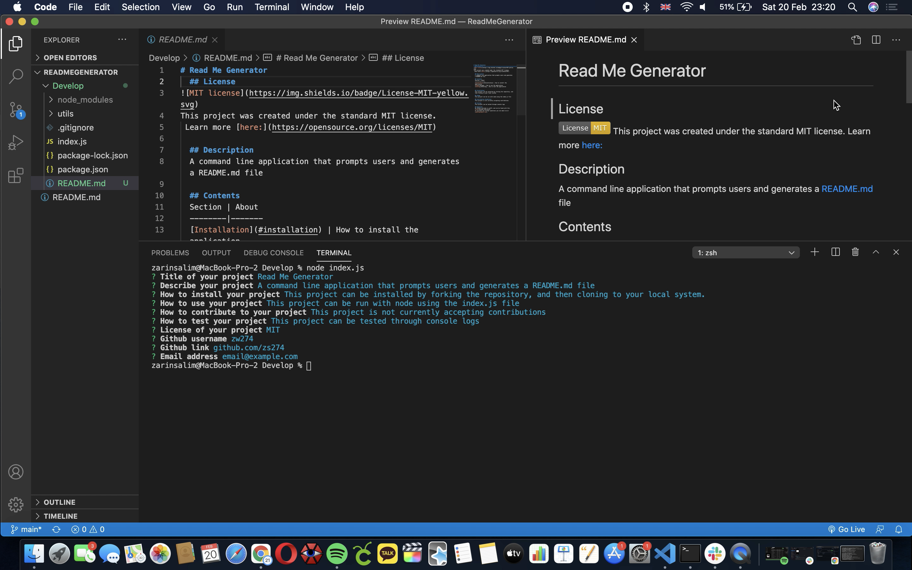

# Read Me Generator
For this assignment we were tasked with creating a command-line application that dynamically generates a professional README file from a user's input using the inquirer package.

## Pseudo Code
1. Install the inquirer package
2. Create user prompts
3. Write functions to generate the README content
4. Write functions to create and display the README file

Based on this, my code would have to:
- Run as a command line application
- Generate a README file

## Difficulties
My main difficulty was making the README file display correctly, but this was a simple fix as I had indented the code lines too much. 

## Overall thoughts
I really enjoyed this assignment and felt like I learned a lot about node. I'm excited to see what I can develop in the future using other node packages. 

You can view a walkthrough of the application [here](https://drive.google.com/file/d/1YQDwfCtIrJ6iqIwrmfCUQvEv-5sLvMUg/view?usp=sharing).

